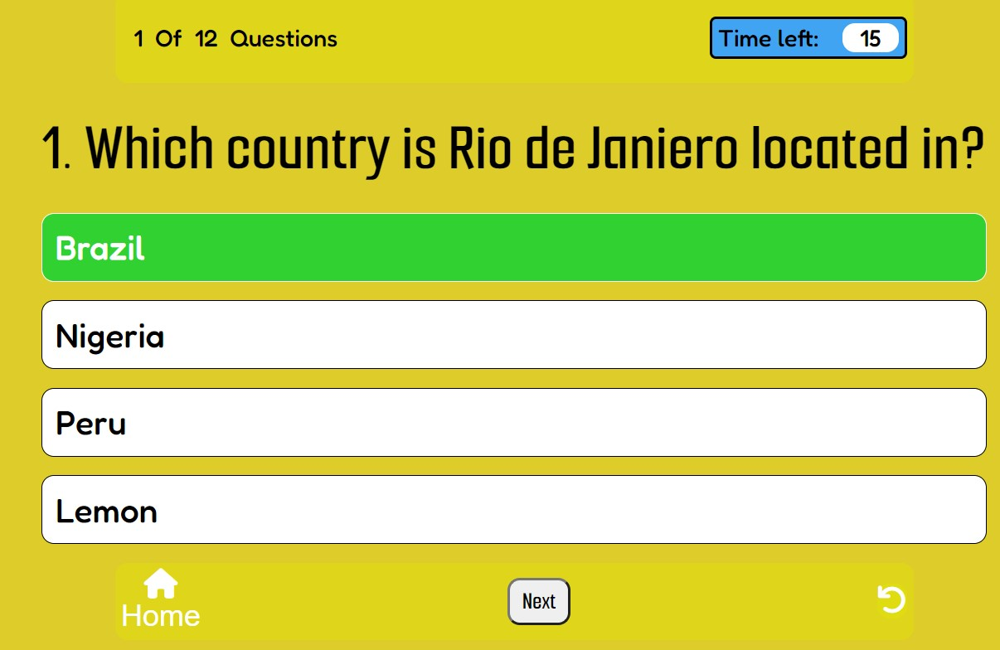
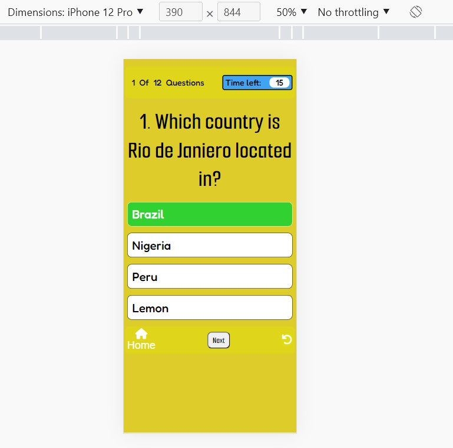
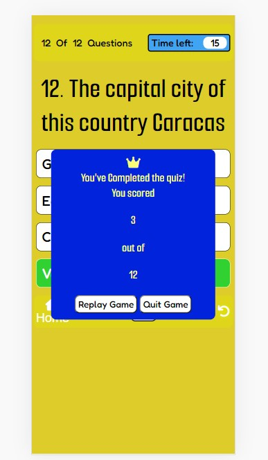
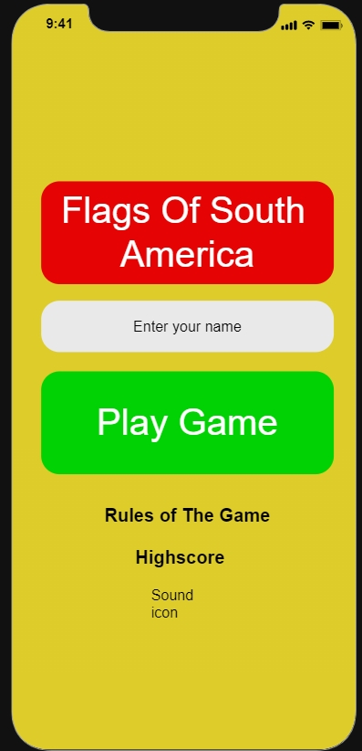

# Countries Of South America

'Countries of South America' will test people's knowledge on countries of South America. In the game there are 12 points to collect, 12 countries in South America, and you will earn these points by getting the answers right. As soon as you start playing the game a quesition that relates to the answer/country will appear, you have to guess which country we are describing or asking you about. If you get the answer right, you will earn a point and will be able to move on to the next question, the goal is to get as many points as you can. There will be a timer, so users can test themselves by seeing who can finish the game the quickest with the highest points.

## Objective
<li>This site is targeted to people who love to test their knowledge, have an interest in geography and especially those who have an interest in the South American countries.</li>

<li>You can view the live link here - "add website link here when completed"</li>

## Features

### <u>Home page</u>
<ul>
<li>In this page you have the name of the game in red, this will instantly give the user an idea of what the game is about. There will be an input where users can enter their names to be able to play the game and record there scores,  there will be a 'Play Game' button to be able to start the game.</li> 
<li>Below these features there will be a 'Rules of The Game', if you press on this button a box with the rules will appear on the screen, this will contain the rules and explain to users how the game works, how earn points and how to complete the game, and if they want, they can also quit or restart the game.<li>

### <u>Within the Game</u>

<li>In this area the game will keep track of what question the user is on, there will be a timer that will make it feel like quiz, this will add more pressure to the game, it is going to be a 15 second timer, when the timer hits 0 the correct answer will be revealed, options will be disabled and user will have to move on to the next question.</li>

<li>In this area there is going to be the question AND the options that users will be able to select from, users will have to read the question and guess which country they are being asked about or which country is being described.</li>
<li>Users can hover over the question, the cursor will become a pointer on the options they can select, the color of he boxes will also change.</li>

<li>After users select their answer, the options will be disabled and they can only select  home, restart or the next question. Pointer will get disabled.</li> 
<li>If the user select the correct answer then their option will turn green, next button will appear</li>

<li>This is the mobile verison of the game, when answer is correct it turns green, will act the same as on the laptop</li>

<li>If users select the wrong answer then their answer will turn red, and the correct answer will appear green</li>

<li>If user does not manage to beat the time then options will get disabled and correct answer will turn green</li>

<li>In this part of the game there will be a Home button, a next question button and the Restart button.</li>
<li>The home button feature will be there incase the user wants to quit the game or to look at the rules again</li>
<li>The 'next' question button will only appear after the user has selected an answer, they won't be able to skip the question, this button will move on to the next question.</li>
<li>The restart feature will restart the game from question one, this will not take the user to the home screen
</ul>

<li>After question is selected next button will appear</li>

<li>When all question have been answered a results box will appear on top of the questions with how many correct answers you got, and then two buttons at the bottom, one to go to the home page or to restart the game and play the game again</li>

<li>This is how the results will appear on a mobile device</li>

## Wireframes 

 

## Design 

<ul>
    <li>Fonts</li>
    
The fonts that will be used for this project are 'Smooch Sans' and 'Fredoka'

    <li>Colors</li>
    
The main color for the game used was yellow (#DECC2A), the title will be in a red container and the 'Play Game' Button is in green container. The main page has a hidden flag within it and these are the colors of Bolivia.

    <li>Wireframe</li>
</ul>

## Technolgies Used

<ul>
    <li>HTML5</li>
    <li>CSS3</li>
    <li>JavaScript</li>
</ul>

## Testing

<h1>Browser Compatability</h1>
<ul>Testing done on these search engines, website opened as it should and executed all questions and features without issues
    <li>Chrome</li>
    <li>Safari</li>
    <li>Internet Explorer</li>
</ul>
<ul>
    <li></li>
    <li></li>
    <li>Resolved bugs</li>
    <li>Unresolved bugs</li>
</ul>

## Deployment

<ul>
    <li></li>
    <li></li>
    <li></li>
</ul>

## Credits

<ul>
    <li></li>
    <li></li>
    <li></li>
</ul>

## Acknowledgements 

<ul>
    <li></li>
    <li></li>
    <li></li>
</ul>

## Future plans 

<ul>
    <li>World wide scope</li>
    <li>Game</li>
    
Users will be able to skip questions and come back to them later once they rememeber, but this feature will only happen when the game gets bigger, so maybe for countries of Europe or all 50 states of America, otherwise, if the game was only 12 questions they can go ahead of the game a narrow all the countries down

    <li></li>
</ul>

