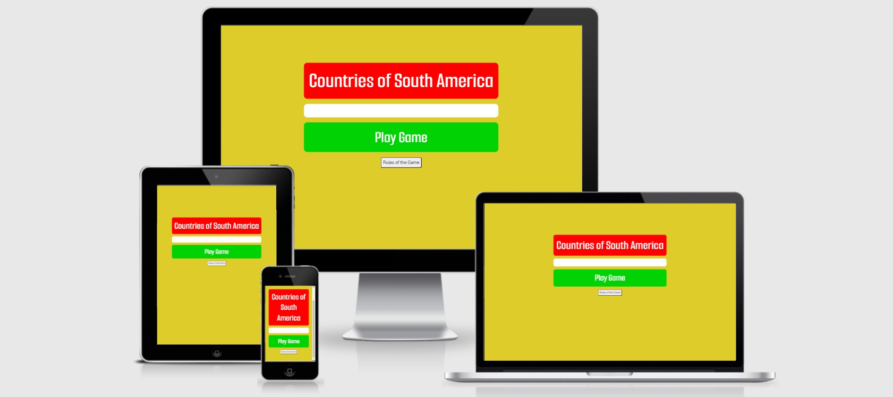
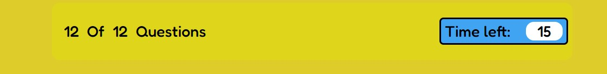
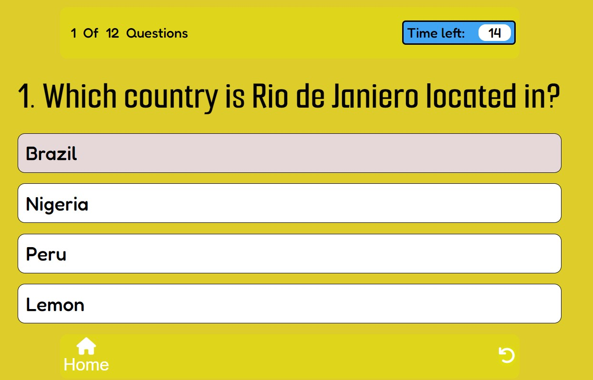
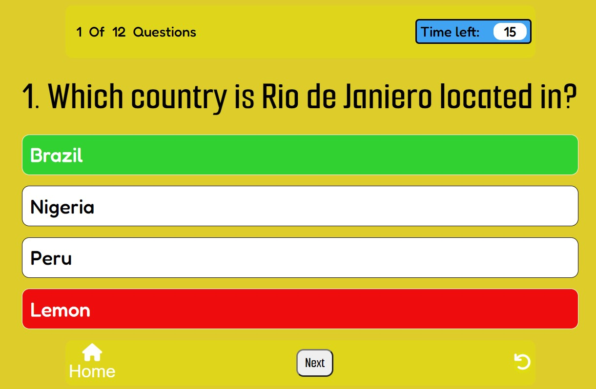
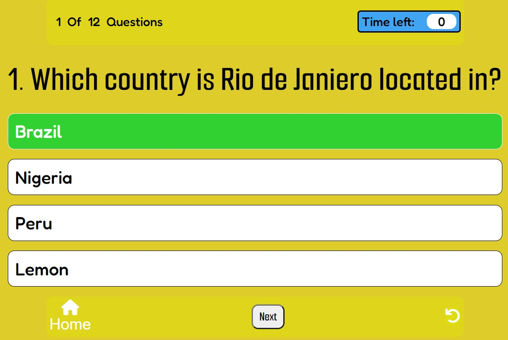
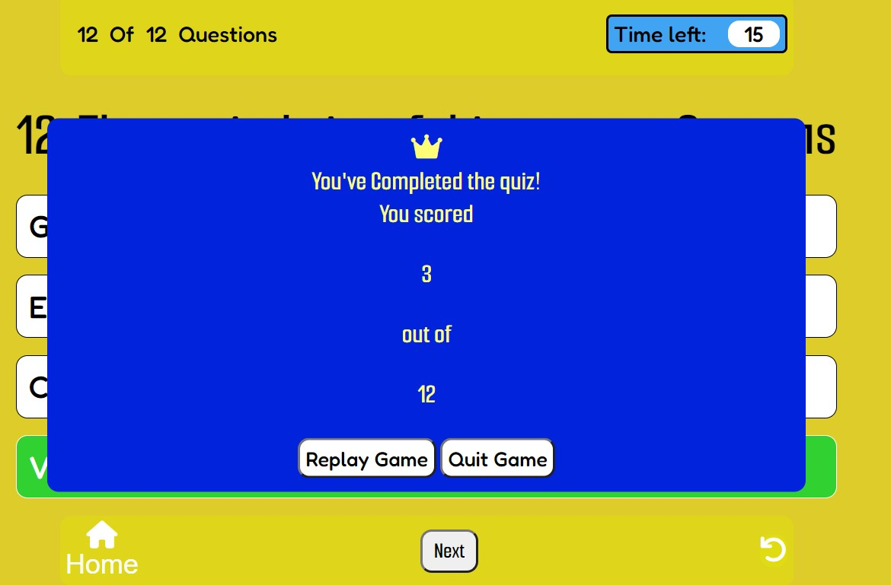
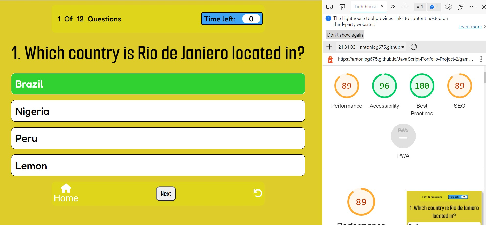
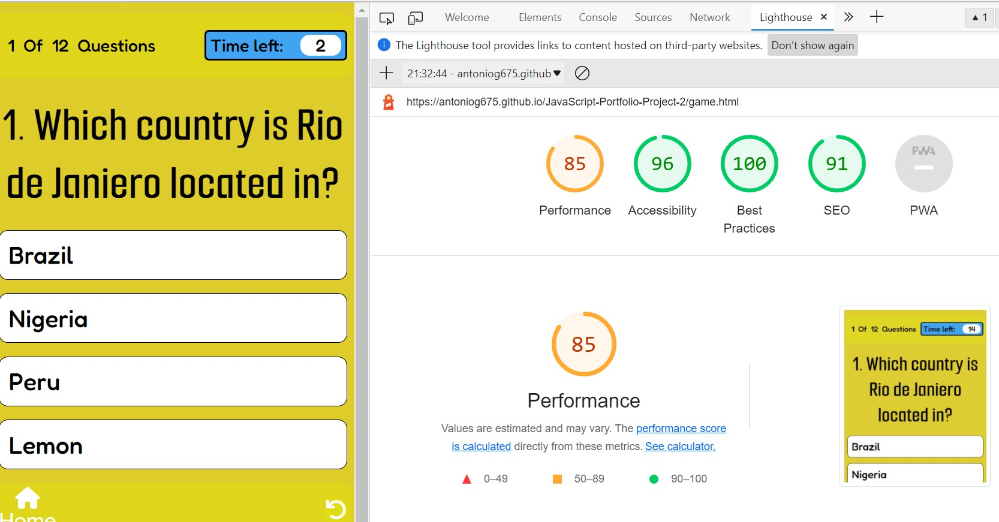

# Countries Of South America

'Countries of South America' will test people's knowledge on countries of South America. In the game there are 12 points to collect, 12 countries in South America, and you will earn these points by getting the answers right. As soon as players start playing the game a quesition that relates to the answer/country will appear, they have to guess which country we are describing or asking them about. If they get the answer right, the player will earn a point and will be able to move on to the next question, the goal is to get as many points as you can. There will be a timer, this adds pressure to the game. If the timer runs out, the question will be answered automatically and users will not be able to select an option.

# Features

## Home page

<ul>
<li>In this page you have the title of the game in red, this will instantly give the user an idea of what the game is about. 
The'Play Game' will launch the game, laod the question and set the timer.</li> 
<li>Below there will be a 'Rules of The Game' button, if you press on this button a box with the rules will appear on the screen, this will contain the rules and explain to users how the game works, how to earn points and how to complete the game, and if they want, the rules will explain that they can also quit or restart the game.<li>

 

## **Rules of the game on Desktop and Mobile screens**

## Within the Game

<li>In this area the game will keep track of what question the user is on, there will be a timer that will make it feel like quiz, this will add more pressure to the game, it is going to be a 15 second timer, when the timer hits 0 the correct answer will be revealed, options will be disabled and user will have to move on to the next question.</li>

<li>In this area there is going to be the question AND the options that users will be able to select from, users will have to read the question and guess which country they are being asked about or which country is being described.</li>
<li>Users can hover over the question, the cursor will become a pointer on the options they can select, the color of he boxes will also change.</li>

<li>After users select their answer, the options will be disabled and they can only select  home, restart or the next question. Pointer will get disabled.</li> 
<li>If the user select the correct answer then their option will turn green, next button will appear</li>

<li>This is the mobile verison of the game, when answer is correct it turns green, will act the same as on the laptop</li>

<li>If users select the wrong answer then their answer will turn red, and the correct answer will appear green</li>

<li>If user does not manage to beat the time then options will get disabled and correct answer will turn green</li>

<li>In this part of the game there will be a Home button, a next question button and the Restart button.</li>
<li>The home button feature will be there incase the user wants to quit the game or to look at the rules again</li>
<li>The 'next' question button will only appear after the user has selected an answer, they won't be able to skip the question, this button will move on to the next question.</li>
<li>The restart feature will restart the game from question one, this will not take the user to the home screen
</ul>

<li>After question is selected next button will appear</li>

<li>When all question have been answered a results box will appear on top of the questions with how many correct answers you got, and then two buttons at the bottom, one to go to the home page or to restart the game and play the game again</li>

<li>This is how the results will appear on a mobile device</li>

 
<h1>Wireframes</h1>

<li>So for my game my initial design was for it to guess the country by the flag, but as I got on with the project it was just difficult to have my idea blossom, I ran into so many obstacles with finding a way to implement the image when the question was called out at random from the array 'questions'.</li>
<li>So I went for a basic quiz question game.</li>
<li>But, even though it doesnt meet my inital wireframe design my game was still inspired by the wireframe, I still have the hidden Bolivian Flag, my game has a timer, instead of keeping track of the score my game keeps track of the question they are on. Unfortunatly I had to bin the 'hint' button, the sound toggling, and the highscore section.</li>

<li>But, I still have a home button, the next question button after user answers, and a restart button</li>

 

## Design 

<ul>
    <li><h2>Fonts</li></h2>
    
The fonts that will be used for this project are 'Smooch Sans' and 'Fredoka'

    
Smooch Sans is going to be used for headings, and for areas where users are going to be looking at majority of the time. Fredoka will be used for the rest of the website, time counter, the results pop up box at the end.

    <li><h2>Colors</h2></li>
    
The main color for the game used was yellow (#DECC2A), the title will be in a red container and the 'Play Game' Button is in green container. The main page has a hidden flag within it and these are the colors of Bolivia.

    
Colors for timer are going to be opposite colors from the main color so that it stand out more, adds accessibility to users so that it does not blend into the background too much.

    
Colors for buttons will invert when user hovers over them, this will add  interactivity and let users know that it is a button and that it can be pressed.

</ul>

## Technolgies Used

<ul> Languages used
    <li>HTML5</li>
    <li>CSS3</li>
    <li>JavaScript</li>
</ul>

<ul>
    <li>Google Fonts</li>
    <li>Font Awesome</li>
    <li>Github</li>
    <li>Gitpod</li>
    <li>ProtoPie</li>
</ul>

# Testing

<h3>Browser Compatability</h3>
<ul>Testing done on these search engines, website opened as it should and executed all questions and features without issues
    <li>Chrome</li>
    <li>Safari</li>
    <li>Internet Explorer</li>
</ul>

## Code Validation
<h3>To test my project I used W3C HTML Validator, W3C CSS Validator and JSHint Validator, between the index.html and game.html there were 4 errors found, the CSS had a few mistake as well with e.g. 'border: solid red;' and the validator said I had to write this differently, 'border: solid; border-color: red;' this was solved but apart from that, no errors. With JSHint I got several errors regarding "	'const' is available in ES6 (use 'esversion: 6') or Mozilla JS extensions (use moz)."
</h3>

<li>W3C HTML Validator</li>

<li>W3C CSS Validator</li>

<li>JSHint</li>

<h2>Lighthouse Testing</h2>

<li>I tested my website using the lighthouse function on Google</li>
<li>These are the results I got</li>
<li>This image is showing the results of the home page of the game</li>

<li>This image is showing the results of the lighthouse testing of the questions area on a desktop</li>

<li>This final image is showing the lighthouse results for the questions area on a mobile</li>

<h2>Lighthouse results using Microsoft edge</h2>

    
<h2>Debugging</h2>

    <ul>
    <li>Resolved bugs</li>
    <li>One of the bugs I got was the console error.favicon, after searching what the problem was it was easy to fix, the website now has a favicon and the error has gone away
    <li>Unresolved bugs</li>
    <li>I have this on my console when I load the index.html, but when I load the game up the console error dissapears and the code is fine....</li>
    </ul>

   

## Deployment

<h2>Deploying the project</h2>
<ol>To the deploy the project we are going to be using GitHub, to be able to launch the website we have to first...
    <li>Go to the GitHub repository and go on the project 'JavaScript-Portfolio-Project-2'</li>
    <li>You will open this repository and select 'Settings' just above the green 'Gitpod' button</li>
    <li>You will scroll down the 'GitHub Pages'</li>
    <li>So for the website to be deployed online we have to select the 'Branch' on the 'Main' and set it to 'main', after this your project will turn green when ready to launch and will look like this...</li>
</ol>

[Screenshot of GitHub pages showing active website link for my game](assets/images/github-deploy.jpg)

## Credits

<ul>Content
    <li>Font taken from Google Fonts</li>
    <li>Icons used from Font Awesome</li>
    <li>Favicon.io for generating the favicon I am currently using</li>
</ul>
<ul>Code
    <li>Many inspirtaions from CI students, I took a look at everyones works, their ideas, their code on how they did what they did. It inspried me to make a quiz game and add some features like a timer or a question counter, these different ideas were inspired by looking at peoples work.</li>
    <li>Searching for different types of ideas on YouTube, StackOverflow gave me different ideas on how to write my code, how to get over obstacles.</li>
</ul>

## Acknowledgements 

I completed this game based of the Learning Objectives for my 2nd Project which is part of my Full Stack Development Course, I'd like to thank my mentor for the help through the project, giving me ideas, inspiring me to keep going and helping me better my code.

## Future plans 

<ul>
    <li>I would like to implement a function where users can put there name down and the game will only let them play when that input area has been filled</li>
    <li>With the name of the user I would like to create a global highscore where every user that played the game can store their codes and other people can see the top codes, this will record the number of correct answers the player got and how quickly they managed to complete the game</li>
    
I would like the  questions to be randomised as well, but I had difficulties with this but I feel with more time and research I will find a way around this.

    <li>This was a struggle for me, when I first started JavaScript I could not follow a code, but now I can follow some code, I wish to write code on the spot instead of searching online for help, but baby steps.</li>
</ul>

